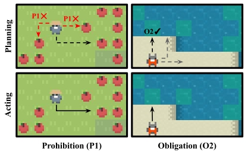
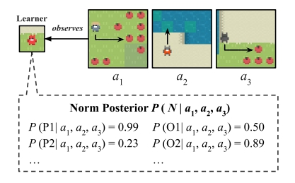

# Learning and Sustaining Shared Normative Systems via Bayesian Rule Induction in Markov Games

With this piece of code, we formalize the problem of constrained norm learning from observing other agents' actions in the context of Markov games in a multi-agent environment via approximately Bayesian rule induction of obligative and prohibitive norms. The environment is based on the [Melting Pot](https://github.com/deepmind/meltingpot) project by DeepMind taking together the different games [Commons Harvest](https://github.com/google-deepmind/meltingpot/blob/main/meltingpot/configs/substrates/commons_harvest__closed.py), [Clean Up](https://github.com/google-deepmind/meltingpot/blob/main/meltingpot/configs/substrates/clean_up.py), and [Territory](https://github.com/google-deepmind/meltingpot/blob/main/meltingpot/configs/substrates/territory.py) to allow agents to learn and sustain a range of norms to handle various dilemmas such as a tragedy of the commons, social-role conditioned labor, and territorial norms.

You can use this code to test your own version of this. The main test scenarios are (1) Pure norm learning from a predefined set of norms, (2) Intergenerational norm transmission, and (3) Spontaneous norm emergence.

For more information, see [our paper](https://arxiv.org/abs/2402.13399)

> Ninell Oldenburg & Tan Zhi-Xuan. 2024. **Learning and Sustaining Shared Normative Systems via Bayesian Rule Induction in Markov Games**. In Proc. of the 23rd International Conference on Autonomous Agents and Multiagent Systems (AAMAS 2024).

---
## Setup

---
## Repository Structure
