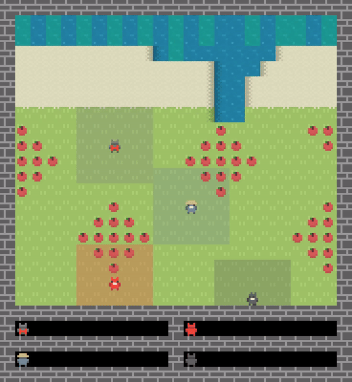

# Learning and Sustaining Shared Normative Systems via Bayesian Rule Induction in Markov Games

With this piece of code, we formalize the problem of constrained norm learning from observing other agents' actions in the context of Markov games in a multi-agent environment via approximately Bayesian rule induction of obligative and prohibitive norms. The environment is based on the [Melting Pot](https://github.com/deepmind/meltingpot) project by DeepMind taking together the different games [Commons Harvest](https://github.com/google-deepmind/meltingpot/blob/main/meltingpot/configs/substrates/commons_harvest__closed.py), [Clean Up](https://github.com/google-deepmind/meltingpot/blob/main/meltingpot/configs/substrates/clean_up.py), and [Territory](https://github.com/google-deepmind/meltingpot/blob/main/meltingpot/configs/substrates/territory.py) to allow agents to learn and sustain a range of norms to handle various dilemmas such as a tragedy of the commons, social-role conditioned labor, and territorial norms.

You can use this code to test your own version of this. The main test scenarios are (1) Pure norm learning from a predefined set of norms, (2) Intergenerational norm transmission, and (3) Spontaneous norm emergence.

For more information, see [our paper](https://arxiv.org/abs/2402.13399)

> Ninell Oldenburg & Tan Zhi-Xuan. 2024. **Learning and Sustaining Shared Normative Systems via Bayesian Rule Induction in Markov Games**. In Proc. of the 23rd International Conference on Autonomous Agents and Multiagent Systems (AAMAS 2024).

## Setup

For this code, your machine requires `Python 3.10` or higher. Follow these steps:

1. Go to the [Melting Pot](https://github.com/google-deepmind/meltingpot) repository and follow their installation steps. It's probably good to skim their repository / docs to get a bit of an idea of the terminology used and how / why they are doing stuff. From their docs: If you get a `ModuleNotFoundError: No module named 'meltingpot.python'` error, you can solve it by exporting the `meltingpot` home directory as PYTHONPATH (e.g. by calling export PYTHONPATH=$(pwd))
2. Download the [meltingpot](https://github.com/ninell-oldenburg/social-contracts/tree/main/meltingpot) directory from this repo and replace the `meltingpot` directory of your newly installed Melting Pot instance. Note: make sure the to-be-replaced directory is your local version of [this one](https://github.com/google-deepmind/meltingpot/tree/main/meltingpot) -- their repository structure is something like `meltingpot/meltingpot` so watch out to not confuse these two.
3. Done! Now you can run the files.

## Test Modes

You can play around in three different modes that differ according to how many agents believe in a set of norms in the onset of the episode and whether agents are mortal. The potental norms are created at agent creation time from a set of observable environment features (see `meltingpot/python/utils/rule_generation.py`)

1. With `learning` you can see how well and how fast norms are being picked up by one learning agent i.e. an agent that does not believe in any norms in the beginning. We detail the process of that approximate Bayesian rule induction in our paper. The idea is that some experienced agents believe in a predefined set of norms and the learning agent learns those by observation.
2. With `intergen` the idea is similar to 1., only that now, on a regular basis (`episode length` / `# agents`) agents die and then resurrect without any norm beliefs. I.e. here you can test which norms can be tranmissed over generations.
3. Lastly, with `emergence` you can see what norms evolve when no agent believes in any norm. They will naturally exhibit *some* behavior to survive, will they *accidentally* follow any norms?

## Repository Structure

Don't be discouraged by this slightly overwhelming load of files in this folder! There are two important folders:
1. `meltingpot` for all substrates (`meltingpot/python/configs/substrates`), agents planning and learning policies (`meltingpot/python/utils/policies/rule_{adjusting|learning}_policy`), and the `Lua` backend (`meltingpot/lua/levels/rule_obeying_harvest/components.lua`)
2. `exmaples` for all code that can invoke the backend (`examples/eval_scripts/view_{learning|intergen|enemergence}_model.py`), experiments (`examples/eval_scripts/eval_{learning|intergen|enemergence}_model.py`), and our results (`examples/results_{learning|intergen|emerge}`) always referring to one of the three modes detailed above.

