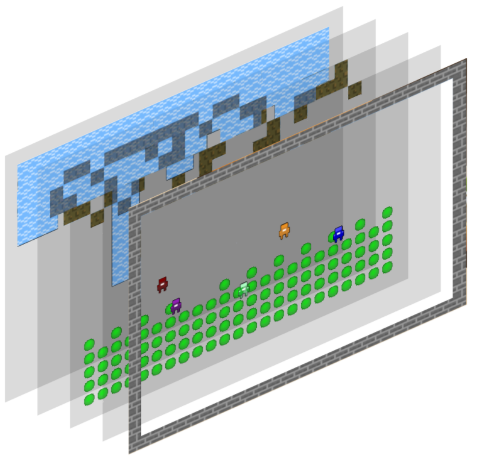
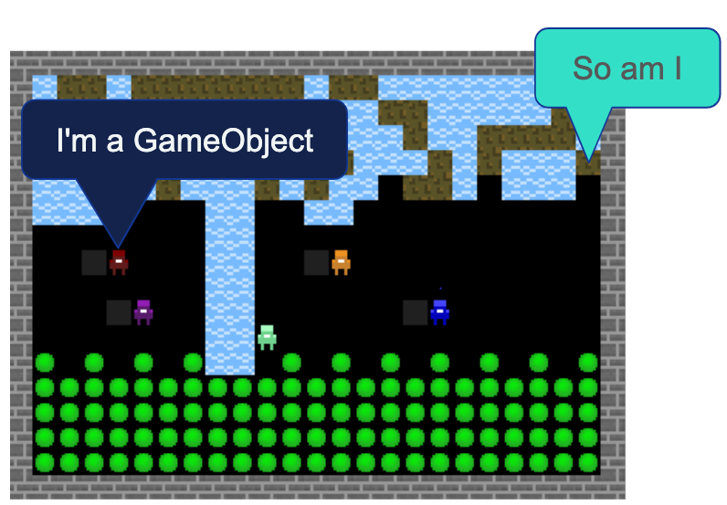
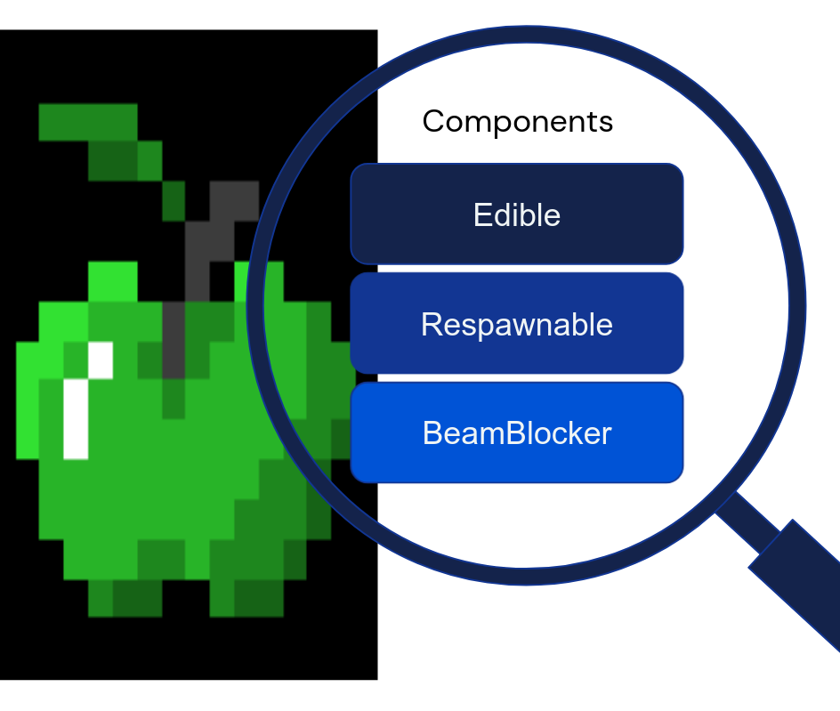
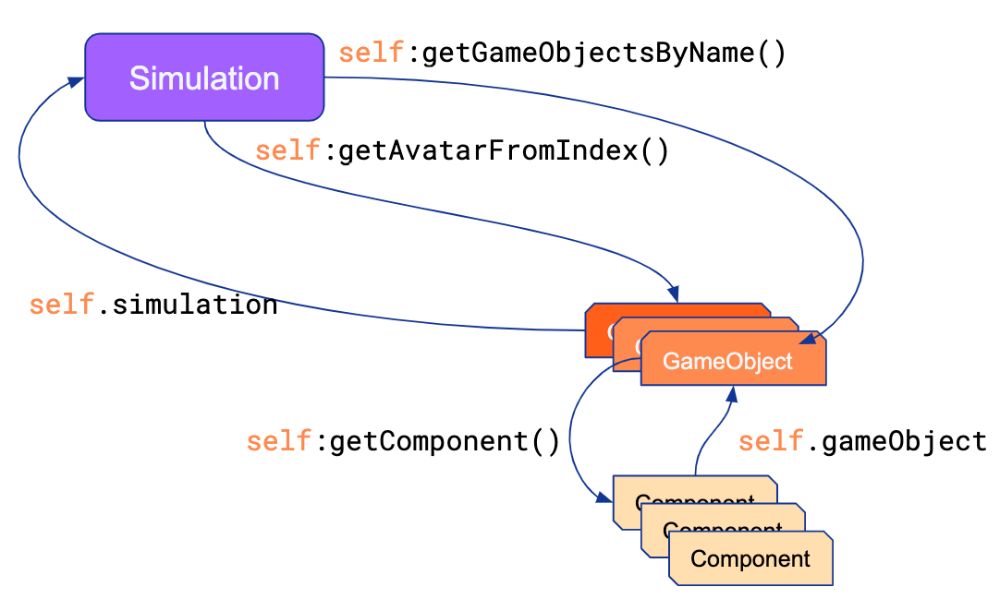

# Melting Pot substrate concepts and design

## Introduction

This document explains the main concepts of the Melting Pot substrates and their
relation to DeepMind Lab2D.

If you want to learn how to create a level using Melting Pot,
[head here instead](substrates.md). A good place to start if you are completely new
to Melting Pot substrates is our [tutorial](substrate_tutorial/index.md).

------

Throughout this document, we distinguish between
[DMLab2D](https://github.com/deepmind/lab2d) (the engine) and Melting Pot (our
framework for creating DMLab2D levels with abstractions for `GameObject`s and
`Component`s). Whenever we refer to the engine, we are talking about DMLab2D.

## DMLab2D main concepts

For more complete information, please refer the
[documentation](https://github.com/deepmind/lab2d/blob/main/docs/lua_levels_api.md)
for DMLab2D.

### The grid

Substrates created with DMLab2D consist of a grid with coordinates `(x, y,
layer)`. You can have as many layers as you want. Layers are indexed by strings,
while `x` and `y` coordinates are non-negative integers. The order in which the
layers are rendered is controlled by the user.



### Piece

Think of a _piece_ like a piece on a chess board. Only one piece can occupy each
specific `(x, y, layer)` position at a time. Pieces can move to different
locations in the grid, including to different layers (either with relative or
absolute movement). Pieces have an orientation (the 4 cardinal directions:
North, East, South and West). Orientations can also can be changed relatively or
absolutely.

Pieces have states, which control the appearance, layer and groups the piece
belongs to. States are represented as strings. Different logic can be assigned
to different states. Pieces can change states dynamically.

### Callbacks

Most of the logic in a created substrate is implemented via callbacks for
specific states of pieces. The engine will call these functions when the
appropriate event or interaction occurs. For more specific details on how and
when the callbacks are called, please refer to the
[advanced documentation](advanced.md).

## Melting Pot

Most of what Melting Pot does is encapsulate the functionality offered by the
grid and the callbacks of pieces into an Object-Oriented paradigm.

The central concepts of this framework are
[`GameObject`s](https://github.com/deepmind/meltingpot/tree/main/meltingpot/lua/modules/game_object.lua)
and
[`Component`s](https://github.com/deepmind/meltingpot/tree/main/meltingpot/lua/modules/component.lua).
See below for more information.

## GameObjects

Every object in Melting Pot is a GameObject, this includes the avatars, walls,
spawn points, purely logical objects, etc. Everything that does anything is a
GameObject. However, a GameObject is an empty vessel that does not by itself
do anything at all.

You need to add Components to a GameObject to make it functional. Different
GameObjects will generally have different combinations of components. This lets
them fill different functions.

Melting Pot comes with a library of built-in Components. If you like, you can
also extend Melting Pot by writing your own Components.



In practical terms, a `GameObject` contains a number of `Component`s. Each
`Component` is a piece of logic (code) that adds to the overall logic of the
`GameObject`.



`GameObject`s have a range of useful functions, for example:

*   `hasComponent(name)`: Returns whether the object has a component of the
    requested `name` (as a string).
*   `getComponent(name)`: Returns the first component found of the named type.
    Typically, only one component of each type is available. It is a failure if
    the objectt does not have a component of the given `name` (as a string).
*   `getComponents(name)`: Returns a list of all the components that have the
    requested `name` (as a string).

In addition to the above methods, there is an important property that is
available after creation, but before any callbacks are performed:

*   `simulation`: A reference to the game `Simulation` (see
    [base_simulation.lua](https://github.com/deepmind/meltingpot/tree/main/meltingpot/lua/modules/base_simulation.lua)
    and below).

A `GameObject` *always* has a
[`StateManager`](https://github.com/deepmind/meltingpot/tree/main/meltingpot/lua/modules/component_library.lua)
component and a
[`Transform`](https://github.com/deepmind/meltingpot/tree/main/meltingpot/lua/modules/component_library.lua)
component. All other components are optional.

Other utility methods specific to required components are detaild below. Refer
to the
[source code](https://github.com/deepmind/meltingpot/tree/main/meltingpot/lua/modules/game_object.lua)
for more detailed information.

NOTE: `GameObject`s cannot currently be added dynamically. A particular
substrate needs to create all objects it will ever need at initialisation time.
Objects that are not immediately needed can be made invisible and immaterial
(i.e. they are dormant and don't interact with any other entity in the
substrate).

### StateManager

The
[`StateManager`](https://github.com/deepmind/meltingpot/tree/main/meltingpot/lua/modules/component_library.lua)
component keeps track of the states of the `GameObject` and provides an API for
switching between them.

The state is composed of the following concepts, but other logic can be attached
to the state in other `Component`s, by having custom logic depending on the
current `GameObject`'s state.

*   `layer` (string): The layer coordinate of the object.
*   `sprite` (string): The name of the sprite that the object uses when it is in
    this state. Usually sprites are managed by the `Appearance` component (see
    below).
*   `groups` (table of strings): The groups of which this object is a member of.
    The concept of groups is used mainly in two ways:
    1.  for obtaining all the objects that currently belong to the group in
        order to perform an action on them.
    2.  to run an updater acting only on objects in a group. See
        [Updaters or update](concepts.md#updaters-or-update) below.
*   `contact` (string): The contact name of the object. Whenever objects enter
    (or leave) the same `(x, y)` coordinate as another object (but at different
    layers), they cause an `onEnter` (or `onExit`) event. The event is tagged
    with this contact name.

For convenience, some of the methods from `StateManager` are available
directly from `GameObject`. The most important ones are:

*   `getState()`: Returns the current state of the object, as a string. This
    value is persistent throughout an update cycle (i.e. an substrate step).
    Changes to the state within an update cycle will be queued to take effect
    after the update.
*   `getAllStates()`: Returns a list of all the possible states that this
    `GameObject` can have.
*   `setState(newState)`: Schedules a state change for this object. The
    parameter must be a string from the valid sets of states for this object.
    State changes are not immediate. They will only take effect after an engine
    update. If you need to record a state change manually, you can save it and
    cache it as desired, but beware that the information might be stale after an
    update.

In addition, a `GameObject` provides other utility functions, like
`getGroupsForType(state)`, `getGroups()` (for the active state), `getSprite()`,
`getLayer()`, etc.

### Transform

The `Transform` component represents an object’s position and orientation. It
provides an API for getting and setting the position and orientation of the
`GameObject`.

Like with `StateManager`, `GameObject` provides some methods to interact
directly with the `Transform`:

*   `getPosition()`: Returns the current position as a table with keys `x` and
    `y` (both integers).
*   `getOrientation()`: Returns the current orientation as a single character
    string from "N", "E", "S", "W".
*   `moveAbs(orientation)`: Moves the object by one grid cell in the absolute
    direction given by `orientation`.
*   `moveRel(orientation)`: Moves the object by one grid cell in the relative
    (to the current orientation) direction given by `orientation`.
*   `teleport(position, orientation)`: Moves the object to the specified
    absolute `position` and `orientation`.
*   `teleportToGroup(groupName, state, orient)`: Moves the object to one of the
    locations occupied by objects in the specified group. It also changes the
    object's state tot he provided new state, and sets the new orientation
    according to the value of `orient`.
    The `orient` parameter is optional. Can be one of:
    *   `grid_world.TELEPORT_ORIENTATION.MATCH_TARGET`
    *   `grid_world.TELEPORT_ORIENTATION.KEEP_ORIGINAL`
    *   `grid_world.TELEPORT_ORIENTATION.PICK_RANDOM`
    The default is `PICK_RANDOM`.
*   `turn(amount)`: Turns this GameObject by a given value `amount`:
    *   `0` -> No Op.
    *   `1` -> 90 degrees clockwise.
    *   `2` -> 180 degrees.
    *   `3` -> 90 degrees counter-clockwise.
*   `setOrientation(direction)`: Sets this GameObject to face a particular
    `direction`:
    *   `'N'` -> North (decreasing y).
    *   `'E'` -> East (increasing x).
    *   `'S'` -> South (increasing y.
    *   `'W'` -> West (decreasing x).

NOTE: `GameObject` and `Transform` also provide the function `getPiece()` which
returns the engine's internal piece ID for this object. The user should not need
to interact with this directly. Instead only use the `GameObject`'s states.

## Components

A `Component` is a piece of logic attached to a `GameObject`. `Component`
instances can only belong to a single `GameObject`. The parent `GameObject` can
be accessed via `self.gameObject`, once the component has been added to the
`GameObject` (this happens at initialisation).



Lua components can have the following methods, all of which are optional:

*   `awake()`: Called when the component is added to a `GameObject`.
*   `reset()`: Called every episode to initialise the `Component`'s internal
    variables, just before `start()`.
*   `start()`: Called once all initialisation is complete.
*   `postStart()`: Called once all game objects have completed their `start`
    calls.
*   `preUpdate()`: Called every frame, always before `update()`.
*   `update()`: Called every frame.
*   `registerUpdaters(updaterRegistry)`: Used instead of `update`, offers fine
    control over the order in which updates happen across components, as well as
    functionality to delay execution & update probabilisitically (see below).
*   `onBlocked(blockingGameObject)`: called when this object attempts and fails
    to enter an occupied (x, y, layer) absolute location.
*   `onEnter(enteringGameObject, contactName)`: Called when another object
    enters the same `(x, y)` location (but in another `layer`) as the containing
    object. `contactName` is the `contact` string associated with the state
    (state) of the entering object.
*   `onExit(exitingGameObject, contactName)`: Called when another object
    occupying the same `(x, y)` location as this object (but in another `layer`)
    leaves the location. `contactName` is the `contact` string associated with
    the state (state) of the entering object.
*   `onHit(hitterGameObject, hitName)`: Called when the object is hit by a beam
    of the `hitName` type created by the hitter object.
*   `onStateChange(previousState)`: Called when the GameObject has
    changed its state. Recall that state changes are not immediate, so this will
    be called in between updates.

In addition to the above functions, there are other functions that are typically
restricted to special types of `Component`s like the `Avatar`, the `Zapper`, or
the `Appearance`. For completeness, these are:

*   `addHits(worldConfig)`: Used to register hits (e.g. a zapper or custom beam)
*   `addSprites(tileSet)`: Adds sprites associated with states. Don't use this
    directly, instead, use the `Appearance` component.
*   `addCustomSprites(customSprites)`: Enables adding sprites that are not
    immediately associated with any state. Don't use this directly, instead use
    the `AdditionalSprites` component.
*   `getSpriteNames()`: Should return a list of all the available sprites for
    use with the object. Don't use this directly, instead use the `Appearance`
    component.
*   `addObservations(tileSet, world, observations)`: Adds observations to the
    substrate. Don't use this directly, instead use the `Avatar` component.
*   `addDiscreteActionsSpec(actSpec)`: Adds entries to the global action spec.
    Don't use this directly, instead use the `Avatar` component.
*   `discreteActions(actions)`: Inform the engine of the actions that are to
    take place at next substrate step. Don't use this directly, instead use the
    `Avatar` component.
*   `addPlayerCallbacks(callbacks)`: Deprecated.

You can find these and other useful components in the
[component_library](https://github.com/deepmind/meltingpot/tree/main/meltingpot/lua/modules/component_library.lua).

## Updaters or `update`

There are two ways to execute code periodically on a `Component`. One is through
the `update` method that simply gets called at each substrate step. While this
is quite generic and flexible, there is no guarantee as to the order in which
updates will be called across `GameObject`s and `Component`s.

The other way to update a component regularly is through the use of an
_updater_. Updaters are handled by the engine, and offer fine control over when
they are executed, for which states they apply, at what rate the update occurs,
and if there is a delay on the onset of the updating after a state change. This
is the approach we use in our substrates.

For full documentation, see the implementation in
[updater_registry](https://github.com/deepmind/meltingpot/tree/main/meltingpot/lua/modules/updater_registry.lua).
Intuitively, instead of defining a function that gets called at every step, you
register an updater function (named or anonymous) along with some parameters
describing when the function will be called. They key parameters are:

*   `priority`: The priority of the update. If not provided, defaults to
    priority 100. Higher priority denotes earlier execution.
*   `startFrame`: The number of frames to wait after any state change to start
    executing this update.
*   `probability`: The probability that the update gets called per time step. By
    default this is set to 1, so that the update function is called every frame.
*   `group`: The group to which the registered updater applies. That is, all
    game objects which are on a state that has this group will have the update
    function registered here called on them. If group is not given, it defaults
    to grouping (corresponding) updates from the same component across all game
    objects.
*   `state`: The game object state for which this functioon should be called. If
    not provided, the function will be called for all states.
*   `states`: a list of states for which this update should be called. This
    takes precedence over `state`. If both are provided, only the value of
    `states` is used.

Updaters are registered within the component's `registerUpdaters` function that
receives an `UpdaterRegistry` instance. There you can register your updaters,
e.g. by:

```lua
  updaterRegistry:registerUpdater{
    priority = 200,
    state = self.config._aliveState,
    updateFn = self:highPriorityUpdate(),
  }
```

### Internal component variables

Components will have two properties `_config` and `_variables`. Both are tables,
and by convention, the `_config` is a table that stores all static information
and parameters for the object (e.g. the parameters passed to the constructor),
whereas `_variables` is used to store mutable data. This distinction is
important to support resetting substrates. When a reset is requested (triggering
a call to `reset()`), all internal variables (i.e. `_variables`) should be
cleared. However, this is not enforced.

You can also create any property in the class instance, just like you would in
Python, e.g. `self._my_property = "Yay!"`.

## Other Concepts

### Simulation

The `Simulation` contains all `GameObject`s. It is in charge of
creating the world configuration (which happens automatically from the
point of view of the user) as well as creating and initialising all the
`GameObject`s.

The simulation has utilities for getting game objects:

*   `getAllGameObjects()`: Return an unordered table of all `GameObject`s.
*   `getGameObjectsByName(name)`: Return all `GameObject`s that have the given
    name as a list.
*   `getAllGameObjectsWithComponent(componentName)`: Return all `GameObject`s
    that have a `Component` called componentName as a list.

The `Simulation` also has functions to find objects from the internal engine
pieces, but this functionality should be largely irrelevant to users.

Avatars are `GameObject`s with the
[`Avatar`](https://github.com/deepmind/meltingpot/tree/main/meltingpot/lua/modules/avatar_library.lua)
component. They are special in that they require special initialisation to
handle spawn points and deferred initialisation of their internal engine piece.
However, from the perspective of the user, avatars should be considered just
another type of `GameObject`.

### RayCast and Queries

[Raycasts and queries](https://github.com/deepmind/lab2d/blob/main/docs/system/grid_world.md#querying)
are ways to get information about objects in specific locations in the grid.

Queries are exposed in Melting Pot through the `Transform` component via:

*   `queryDiamond(layer, radius)`: Returns a list of all `GameObject`s with an
    L1 distance to the calling object's position that is less than or equal to
    radius. In a torus topology the positions returned are not normalised.
*   `queryDisc(layer, radius)`: Like `queryDiamond`, but using the L2 distance
    to the calling object's position.

Rays are exposed through beams. When a beam touches an object, its `onHit`
callback is executed with the specific hit name as parameter. See the
[`Zapper`](https://github.com/deepmind/meltingpot/tree/main/meltingpot/lua/modules/avatar_library.lua)
component for more details.

### API Factory

The
[API Factory](https://github.com/deepmind/meltingpot/tree/main/meltingpot/lua/modules/api_factory.lua)
is a native concept of DMLab2D. It is the main entry point of the Lua bindings
of the internal C++ engine. The API Factory defines the order of calls on the
API object. All substrates are initialised from an subclass of the API Factory
that contains a `Simulation`.

The user will likely never have to interact directly with this object.

## Python interoperability

Melting Pot is fully accessible through Python. The entire configuration of the
level is defined by a Python dictionary. In principle, the only time you will
need to write Lua is when you are writing a new custom `Component`. For some
examples, see the substrate configurations.

For more information, see the [level creation guide](substrates.md).
